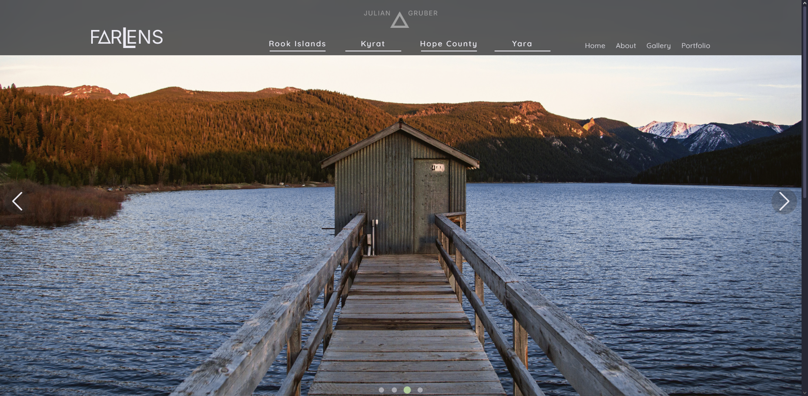

# FarLens

FarLens is a minimalist and artistic web project that showcases the real-world landscapes featured in the _Far Cry_ video game series (parts 3 to 6) through stunning photography and clean design.

## Technologies Used

- **Vite**
- **React**
- **JavaScript**
- **CSS**

## Features

- Displays themed photo galleries representing different _Far Cry_ game worlds:

  - Far Cry 3: Rook Islands
  - Far Cry 4: Kyrat
  - Far Cry 5: Hope County
  - Far Cry 6: Yara

- Real photographs sourced from talented photographers, credit included
- Clean, responsive layout optimized for all screen sizes
- Smooth hover effects on images to enhance user interaction
- Consistent color schemes using CSS variables to reflect each game’s aesthetic

## Live Demo

Check out the live project here: [FarLens](https://farlens.netlify.app)
